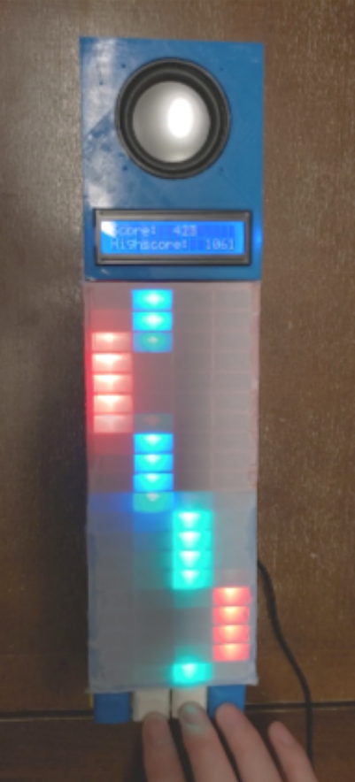

# piano-tiles-arduino

## Objective
The objective of this project is to design and prototype a gaming/training device that provides hand-eye coordination rehabilitation. The device, TacTiles, takes inspiration from the popular mobile game, Piano Tiles. Instead of using a touchscreen, our device provides tactile, visual, and audio feedback as the user interacts with the game. These features will make using this device fun and encouraging for the users.

## Implementation
The main user input devices is a set of four mechanical switches below a LED display matrix. The LED display matrix displays the notes scrolling down, similar to the original Piano Tiles. The user’s score is displayed by a standard LCD display on top of the display matrix. At the beginning of each game, the user can choose the difficulty through a simple UI on the LCD. During the game, each note of the melody starts playing when user presses the correct button, and stops playing when the assigned interval for that note finishes (i.e. when the LEDs representing that note scrolls to the bottom). The harmony starts playing at the first correct buttons press and plays continuously until the game finishes. The game loop is executed with an Arduino Uno programmed in C++.

